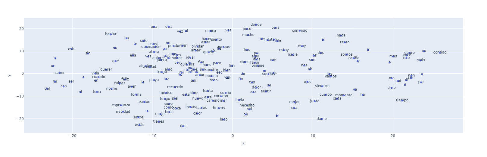
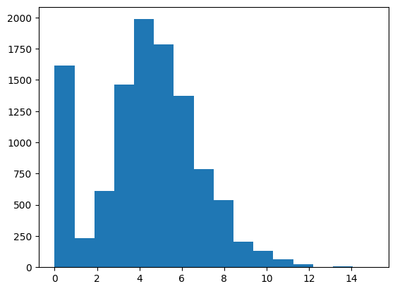
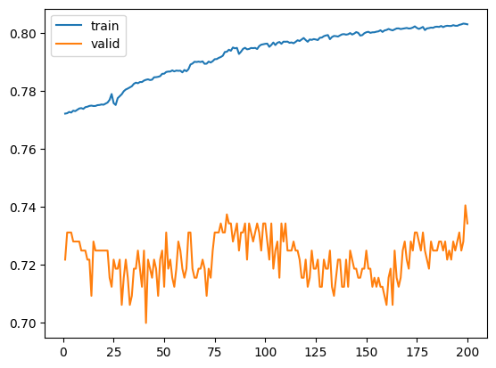
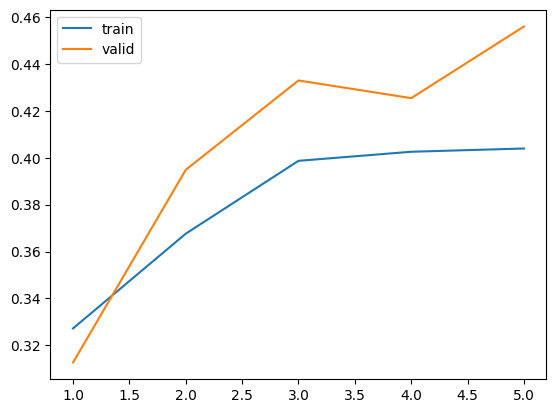
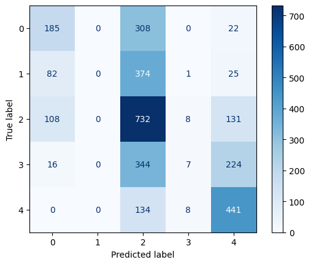
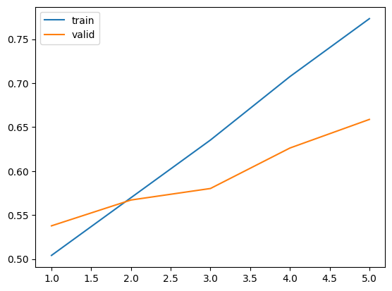
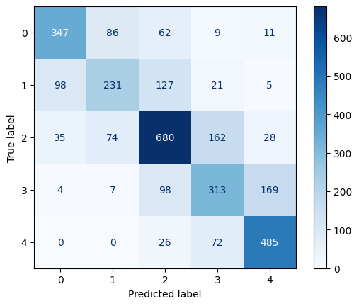

# Procesamiento del Lenguaje natural
Este repositorio contiene el material de clases (presentaciones, ejercicios y notebooks) para NLP (CEIA - FIUBA) desarrollado por el Dr. Rodrigo Cardenas Szigety y los ejercicios resueltos propuestos como desafíos para la materia, por el alumno Kevin Zenklusen.

## Contenido

### [Clase 1](clase_1/README.md) 
* Introducción a NLP (Natural Language Processing)
* Vectorización de documentos

### [Clase 2](clase_2/README.md)
* Preprocesamiento de texto
* Librerías de preprocesamiento para NLP
* Information-retrieval bots

### [Clase 3](clase_3/README.md)
* Word embeddings, CBOW y SkipGRAM
* Representación de palabras

### [Clase 4](clase_4/README.md)
* Redes recurrentes (RNN)
* Problemas de secuencia
* Estimación de próxima palabra

### [Clase 5](clase_5/README.md)
* Redes LSTM
* Análisis de sentimiento (sentiment analysis)
    
### [Clase 6](clase_6/README.md)
* Modelos Seq2Seq
* Bots conversacionales y traductores

### [Clase 7](clase_7/README.md)
* Celdas con Attention
* Transformers
* BERT y ELMo
* Fine tuning

### [Clase 8](clase_8/README.md)
* Cierre del curso
* Deployment de servicio NLP
* Flask, APIs
* Docker y Tensorflow Serving (TFX)

### [Desafío 1](clase_1/ejercicios/Desafio_1.ipynb)

#### Consigna del desafío 1

**1**. Vectorizar documentos. Tomar 5 documentos al azar y medir similaridad con el resto de los documentos.
Estudiar los 5 documentos más similares de cada uno analizar si tiene sentido
la similaridad según el contenido del texto y la etiqueta de clasificación.

**2**. Entrenar modelos de clasificación Naïve Bayes para maximizar el desempeño de clasificación
(f1-score macro) en el conjunto de datos de test. Considerar cambiar parámteros
de instanciación del vectorizador y los modelos y probar modelos de Naïve Bayes Multinomial
y ComplementNB.

**3**. Transponer la matriz documento-término. De esa manera se obtiene una matriz
término-documento que puede ser interpretada como una colección de vectorización de palabras.
Estudiar ahora similaridad entre palabras tomando 5 palabras y estudiando sus 5 más similares.

Esta actividad muestra cómo aplicar técnicas de procesamiento de lenguaje natural para vectorizar documentos, analizar su similaridad, y entrenar modelos de Naïve Bayes, optimizando su desempeño en la clasificación de textos. Además, la transposición de la matriz documento-término para estudiar la similaridad entre palabras proporcionó una nueva perspectiva sobre las relaciones semánticas en el vocabulario.

### [Desafío 2](clase_2/ejercicios/Desafio_2.ipynb)

#### Consigna del desafío 2

A partir de un corpus elegido por el alumno, generar embeddings y analizar los vectores generados mediante comparaciones de palabras y gráficos.

Para la realización de este desafío se utiliza como plantilla un notebook trabajado en clase (Custom embeddings con Gensim).
El objetivo es utilizar documentos / corpus para crear embeddings de palabras basado en ese contexto. Se utilizó la discografía completa de Luis Miguel para generar los embeddings.

Al generar los embeddings y analizar los resultados se pueden apreciar las relaciones entre palabras similares, como es el caso de "bikini" y "azul", debido a la canción "La chica del bikini azul".

##### Test de analogía
Debido a la naturaleza del corpus y a la poca cantidad de datos, resulta difícil crear un buen test de analogías. Sin embargo se plantea como ejemplo una relación dada por palabras específicas contenidas en la canción "Entrégate", cuyo estribillo dice: 
*"Entrégate, aun no te siento
Deja que tu cuerpo se acostumbre a mi calor"* 
A partir de esto, planteamos la siguiente relación:
"Siento" es a "entrégate" como "calor" es a...
Siendo que, dentro de las palabras similares, encontramos "cuerpo"

##### Agrupación de vectores
Mediante técnicas de reducción de dimensionalidad es posible graficar la distribución de los vectores en un espacio bidimensional

Aquí se ve cómo la palabra amor ocupa un lugar central, acorde a lo que podríamos esperar de un cantante de canciones románticas.

### [Desafío 3](clase_3/ejercicios/Desafio_3_word.ipynb)

#### Consigna del desafío 3
- Seleccionar un corpus de texto sobre el cual entrenar el modelo de lenguaje.
- Realizar el pre-procesamiento adecuado para tokenizar el corpus, estructurar el dataset y separar entre datos de entrenamiento y validación.
- Proponer arquitecturas de redes neuronales basadas en unidades recurrentes para implementar un modelo de lenguaje.
- Con el o los modelos que consideren adecuados, generar nuevas secuencias a partir de secuencias de contexto con las estrategias de greedy search y beam search determístico y estocástico. En este último caso observar el efecto de la temperatura en la generación de secuencias.

En esta actividad, se utilizó nuevamente la discografía de Luis Miguel como corpus de texto y se la preprocesóy estructuró para entrenar modelos de lenguaje utilizando redes neuronales recurrentes como SimpleRNN, LSTM y GRU. Se exploraron distintas estrategias de generación de secuencias, como greedy search y beam search, analizando el impacto de la temperatura en la generación estocástica. El proceso permitió comprender cómo las diferentes arquitecturas y técnicas de optimización afectan el rendimiento del modelo, guiándonos por la perplejidad para evaluar y finalizar el entrenamiento.

Al analizar el corpus, se consideraron valores como la cantidad de palabras contenidas en un verso, para poder definir el tamaño del contexto a utilizar.

Para este ejercicio se probaron distintas configuraciones del modelo obteniendo resultados que no son funcionales en ninguno de los casos. No obstante, en algunos modelos la coherencia entre las palabras fue mejor que en otros. 
Se utilizaron capas GRU para reducir el tiempo de entrenamiento implementando capas intermedias más simples.
Se intentó cambiar el optimizador (adam), pero los resultados empeoraron, por lo que se descartó esa opción.
Como resultado final se presenta entonces un modelo que genera resultados con una coherencia básica teniendo un tiempo de entrenamiento mejorado en relación a usar sólo LSTM.

### [Desafío 4](clase_6/ejercicios/6-%20bot_qa.ipynb)

El desafío consiste en utilizar datos disponibles del challenge ConvAI2 (Conversational Intelligence Challenge 2) de conversaciones en inglés para construir un BOT para responder a preguntas del usuario (QA).

Para la realización de este desafío se descargaron los datos correspondientes al dataset ConvAI2.

Se reealizó el preprocesamiento necesario para obtener:
- word2idx_inputs, max_input_len
- word2idx_outputs, max_out_len, num_words_output
- encoder_input_sequences, decoder_output_sequences, decoder_targets

Para generar los embeddings se utilizó la vectorización FastText, lo que permite transformar los tokens de entrada en vectores.
El entrenamiento del modelo fue basado en el esquema encoder-decoder utilizando los datos generados en los puntos anteriores. Utilcé como referencias los ejemplos vistos en clase.
Se utilizó un learning rate de 0.01 y como optimizador RMS, ya que con Adam no logré buenos resultados.

Por último se pide experimentar el funcionamiento del modelo.
El mismo no responde correctamente (como era esperado) pero genera diferentes respuestas en función del conjunto de entrada que tiene una presumible coherencia en algunos casos como relacionar "hobbies" con "student", "are you" con "fine" o "i love to read" con "what is your favorite", siendo las útlimas un par de frases coherentes en una conversación.

### [Desafío 5](clase_7/jupyter_notebooks/tensorflow/7d%20-%20bert%20sentiment%20analysis%20multicategorial.ipynb)

Aquí se requiere entrenar un modelo BERT para realizar análisis de sentimientos, teniendo como clases de salida 5, e implementando una capa densa extra.
Se descargó el modelo preentrentado (bert-base-uncased) y se lo modificó de forma tal que pueda llevar a cabo la tarea requerida.
Las clases fueron definidas como ['very negative', 'negative', 'neutral', 'positive', 'very positive'].
Se realizaron 2 entrenamientos siendo la diferencia entre ambos la implementación de fine-tunning, quedando en evidencia la mejora en el segundo caso.

Sin fine-tunning:

Con fine-tunning:

# Profesores
:octocat: Dr. Rodrigo Cardenas Szigety (2022-actual)\
:octocat: Esp. Ing. Hernán Contigiani (2021-2022)
